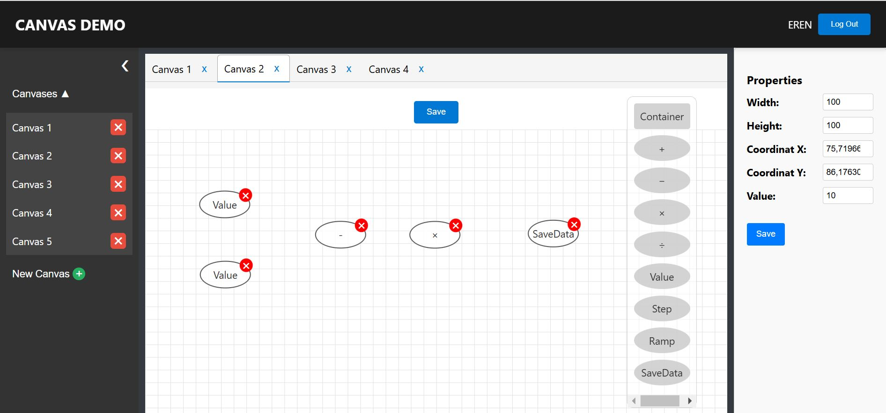

# Canvas Management Project

This project is a web application where users can register, create new canvases, and add or manage elements on these canvases. Users can perform various actions with the elements directly on the canvas. The project is built with a layered architecture and leverages modern technologies for both the backend and frontend.



## Technologies Used

### Backend
- **Framework**: .NET 6
- **Architecture**: Layered Architecture (Entities, Data Layer, Business Layer, UI Layer)
- **Database**: Code-First approach with Entity Framework

### Frontend
- **Framework**: React
- **State Management**: Redux
- **Styling**: SASS

## CORS Configuration
In the backend, Cross-Origin Resource Sharing (CORS) is restricted to allow requests only from `http://localhost:3000` for development purposes. This configuration prevents unauthorized requests from other origins.

## Database Setup (Code-First Approach)

The project uses the Code-First approach with Entity Framework for database management. Follow these steps to set up the database:


### 4. Apply Migrations
Run the following commands in the Package Manager Console or terminal:

1. Set DataLayer Project as Startup project

2. Add a migration:
   ```bash
   dotnet ef migrations add InitialCreate
   ```

3. Update the database:
   ```bash
   dotnet ef database update
   ```

## Registration and Security
The registration feature is symbolic and lacks advanced password security measures. This minimal implementation was chosen for simplicity during development. However, for improved security in production, consider the following:
- Use hashed and salted passwords (e.g., with libraries like `BCrypt`).
- Enforce strong password policies.
- Implement secure authentication protocols (e.g., OAuth2 or JWT).


## Running the Project

### Steps
1. Clone the repository.
2. Start backend project by setting UI as startup project or navigate to the server project folder and run:
   ```bash
   dotnet restore
   dotnet run
   ```
3. Navigate to the client project folder and run:
   ```bash
   npm install
   npm start
   ```
4. Access the application at `http://localhost:3000`.

